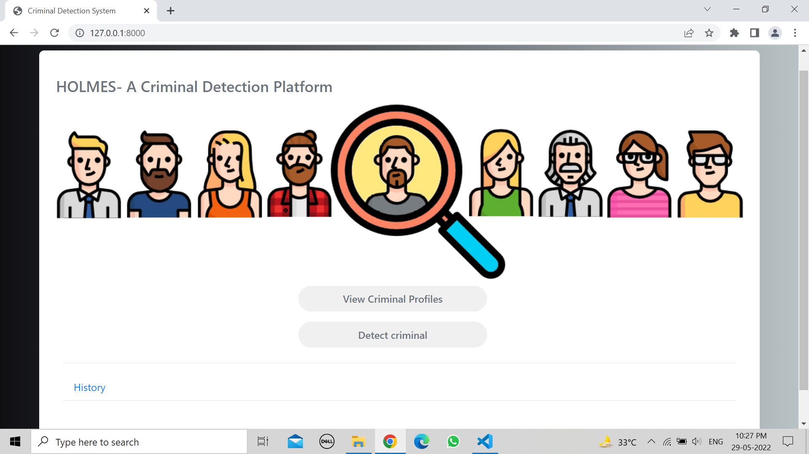
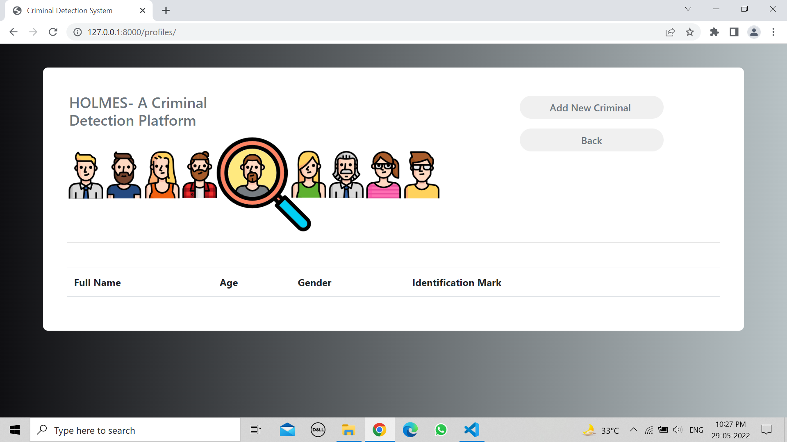
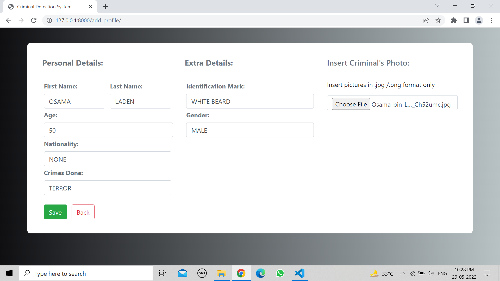
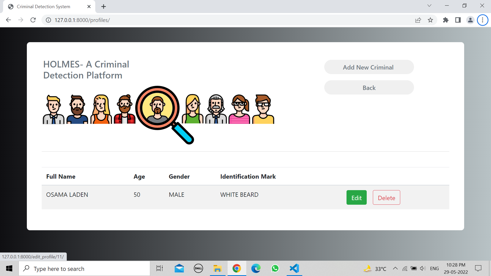
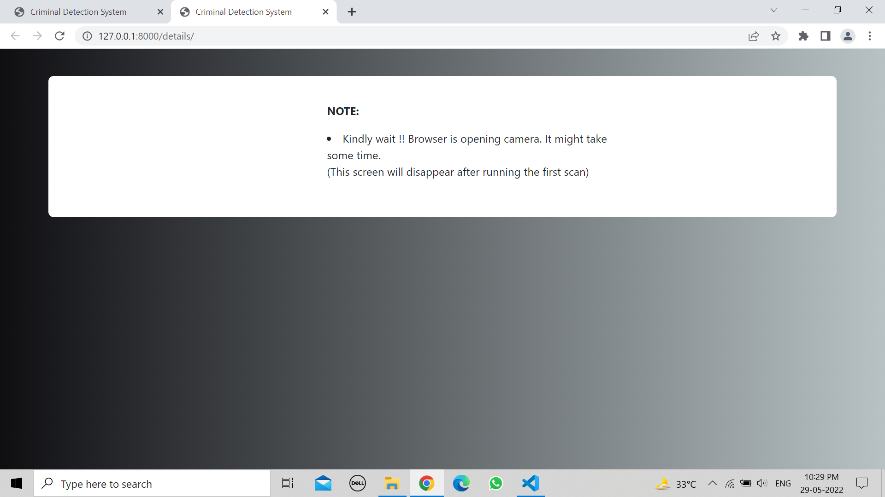
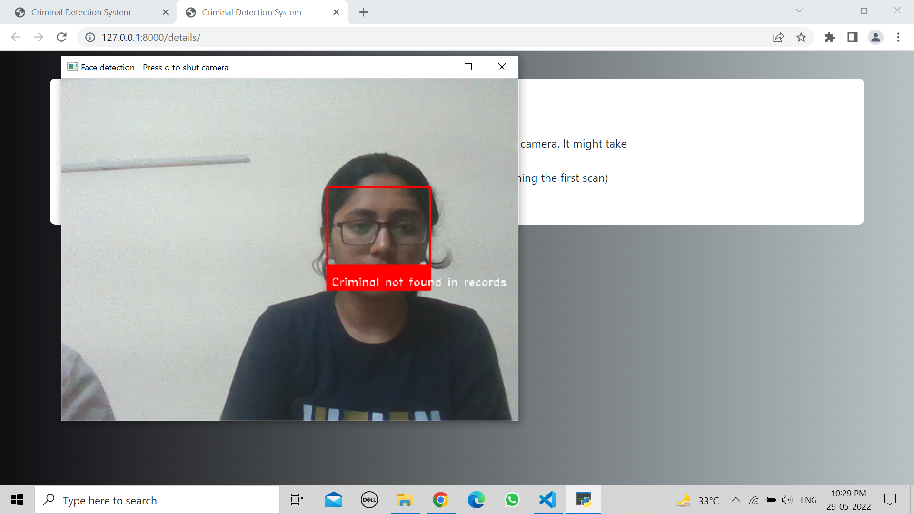
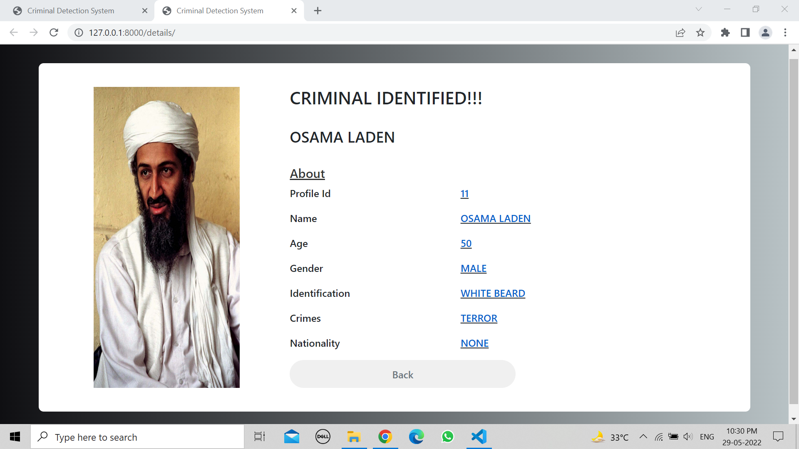
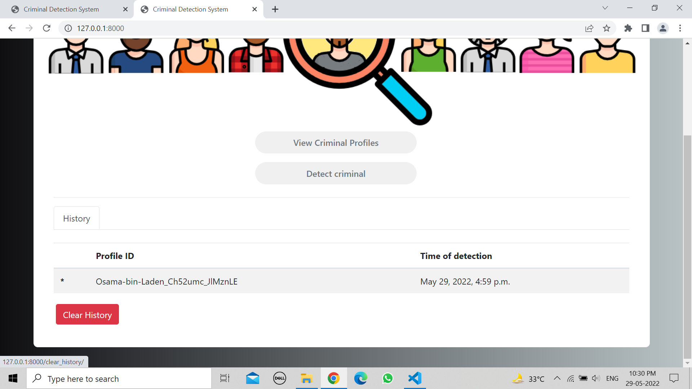

<h1 align='center'>HOLMES</h1>

## About the Website

- <b>'HOLMES'</b>  is a web application based on facial recognition technology which matches a criminal’s face and finds if he or she has any previous crime record or not in a matter of just few seconds.

- <b>Languages and Technologies used : </b> Python, HTML & CSS
- Django web framework was used for the development of the whole web app. OpenCv and face_recognition API's were used for the development of Face Recognizer. 


**Note: Python version 3.9.13 was used for this project.**


## Requirements to run the website
Requirement 1: 

Install python version>=3.7

**Now run the following commands:**

Requirement 2: 
```python
pip install --upgrade pip
``` 
Requirement 3: 
```python
pip install cmake 
```
Requirement 4: 
```python
pip install dlib
``` 
(if any error in installing dlib then try this) 

Check Python Version Type in cmd
```python
python --version
```
And then

For Python 3.7..
```python
pip install https://github.com/Murtaza-Saeed/dlib/raw/master/dlib-19.19.0-cp37-cp37m-win_amd64.whl
```

For Python 3.8..
```python
pip install https://github.com/Murtaza-Saeed/dlib/raw/master/dlib-19.19.0-cp38-cp38-win_amd64.whl
```
For Python 3.9..
```python
pip install https://github.com/Murtaza-Saeed/dlib/raw/master/dlib-19.22.1-cp39-cp39-win_amd64.whl
```
For Python 3.10..
```python
pip install https://github.com/Murtaza-Saeed/dlib/raw/master/dlib-19.22.99-cp310-cp310-win_amd64.whl
```
Requirement 5: 
```python
pip install face_recognition
```
Requirement 6: 
```python
pip install opencv-python
```
Requirement 7: 
```python
pip install django
```

**To run the web app on your local computer, clone this repository, open the terminal in the same directory and run the following command :**
```python
python manage.py runserver
```
Open your favorite browser. I recommend using Google Chrome or Brave and open the following url:


## Screenshots
<h3 align='center'>Home Page</h3>



<h3 align='center'>Click on add criminal button</h3>



<h3 align='center'>Fill all the details of criminal and upload 1 photo</h3>



<h3 align='center'>Can edit or delete the profile if wanted</h3>



<h3 align='center'>This page is shown if camera is opened</h3>

<h3 align='center'>If criminal is not in records</h3>


<h3 align='center'>If criminal found in records</h3>


<h3 align='center'>Criminal profile is shown</h3>


<h3 align='center'>Can view and clear history</h3>

